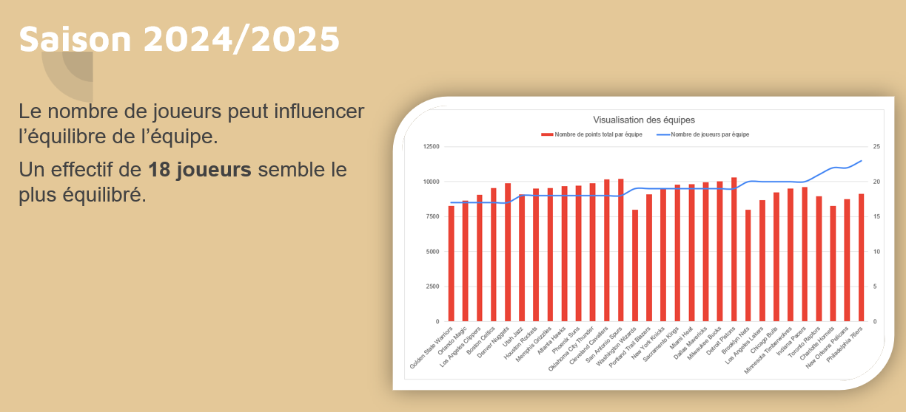
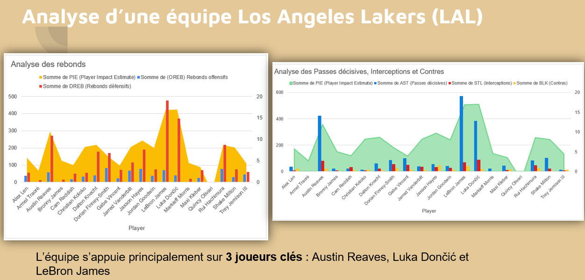
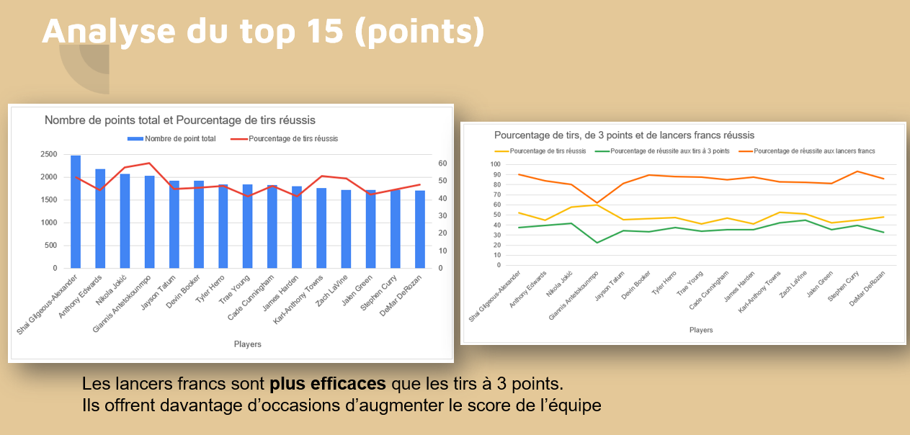
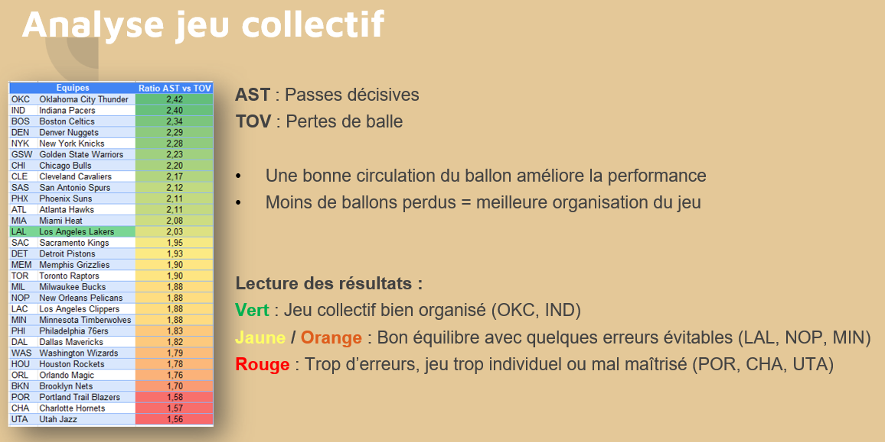
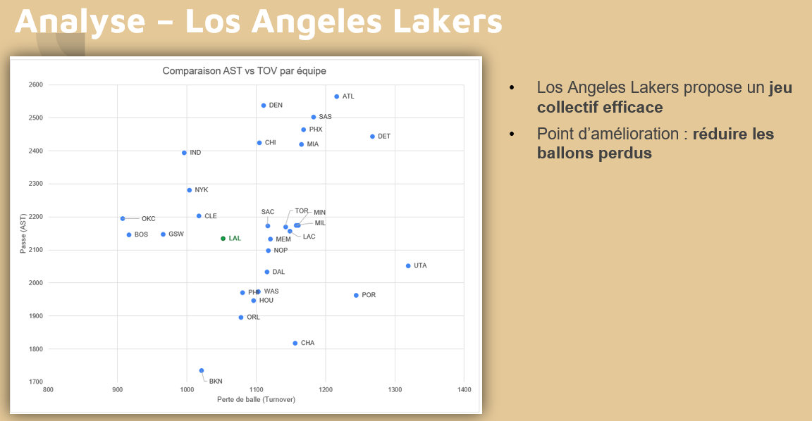

# Les Pionniers – Analyse de performance sportive avec Excel

## Contexte

Projet réalisé dans le cadre de la formation **Business Intelligence Analyst – OpenClassrooms**.

Le club de basketball semi-professionnel **Les Pionniers** souhaite progresser sportivement avec pour objectif une montée en division supérieure à horizon cinq ans.

Afin d'identifier des leviers de performance, une analyse des données de la saison **NBA 2024/2025** a été réalisée avec Excel.

L'objectif était de transformer un jeu de données sportives en informations compréhensibles et exploitables afin d'accompagner les décisions du club.

---

## En résumé

**Objectif :** analyser les performances observées en NBA afin d'identifier des facteurs pouvant contribuer à la performance d'une équipe.

**Problématique :** quels indicateurs permettent de mieux comprendre la performance individuelle et collective d'une équipe de basketball ?

**Compétences clés :** Excel • Tableaux croisés dynamiques • Analyse exploratoire • Data Visualisation • Analyse métier • Data Storytelling.

---

## Besoin métier

Les Pionniers souhaitent disposer d'éléments objectifs permettant de mieux comprendre les facteurs associés à la performance sportive.

L'analyse vise notamment à étudier :

- les performances globales des équipes ;
- les performances individuelles des joueurs ;
- l'efficacité offensive ;
- les rebonds ;
- les passes décisives ;
- les interceptions et contres ;
- les pertes de balle ;
- certains indicateurs de jeu collectif.

L'enjeu consiste à passer de données statistiques brutes à des informations pouvant alimenter la réflexion du staff sportif.

---

## Données

Le jeu de données porte sur la saison **NBA 2024/2025**.

Il comprend notamment :

- 30 équipes ;
- 569 joueurs ;
- les résultats des matchs ;
- les temps de jeu ;
- les points ;
- les taux de réussite ;
- les rebonds ;
- les passes décisives ;
- les interceptions ;
- les contres ;
- les pertes de balle ;
- différents indicateurs de performance des joueurs.

---

## Outils utilisés

- Microsoft Excel
- Tableaux croisés dynamiques
- Fonctions d'analyse Excel
- Mise en forme conditionnelle
- PowerPoint pour la restitution des résultats

---

## Méthode

La démarche d'analyse a été structurée en plusieurs étapes :

1. étude et compréhension des données ;
2. analyse d'un exemple existant ;
3. préparation et contrôle des données ;
4. création de tableaux de synthèse ;
5. réalisation de graphiques ;
6. utilisation de mises en forme conditionnelles ;
7. calcul et comparaison des résultats ;
8. interprétation des résultats ;
9. formulation de recommandations.

---

## Analyse globale de la saison

Une première analyse permet de comparer les équipes de NBA à partir de leur effectif et de leur nombre total de points.

Cette vue fournit un premier niveau de compréhension des différences observées entre les équipes.

Cette étape permet de passer d'un jeu de données détaillé à une vision synthétique facilitant la comparaison des équipes.

---

## Analyse d'une équipe

Une analyse plus détaillée a ensuite été réalisée sur les **Los Angeles Lakers**.

Elle permet d'étudier plusieurs dimensions de la performance individuelle :

- rebonds offensifs et défensifs ;
- passes décisives ;
- interceptions ;
- contres ;
- indicateur d'impact global du joueur.

L'analyse met notamment en évidence le rôle important de plusieurs joueurs dans les performances de l'équipe.

Cette approche permet d'identifier les joueurs contribuant à différentes dimensions du jeu plutôt que de se limiter au nombre de points inscrits.

---

## Analyse des joueurs les plus performants

Une analyse du **Top 15 des joueurs en nombre de points** a été réalisée afin de comparer plusieurs indicateurs offensifs.

Les analyses portent notamment sur :

- le nombre total de points ;
- le pourcentage de tirs réussis ;
- le pourcentage de réussite à trois points ;
- le pourcentage de réussite aux lancers francs ;
- l'impact global des joueurs.

Cette comparaison permet d'élargir l'analyse de la performance au-delà du seul nombre de points marqués.

---

## Analyse du jeu collectif

Une analyse complémentaire a été réalisée afin d'étudier le rapport entre :

- **AST : passes décisives**
- **TOV : pertes de balle**

Un ratio AST/TOV permet de comparer les équipes selon leur capacité à créer des passes décisives tout en limitant les pertes de balle.

La mise en forme conditionnelle permet de distinguer visuellement différents niveaux de performance.

Cette analyse permet de disposer d'un indicateur complémentaire sur l'organisation collective du jeu.

---

## Positionnement des Los Angeles Lakers

Une représentation sous forme de nuage de points permet de positionner les équipes en fonction du nombre de passes décisives et de pertes de balle.

Les Los Angeles Lakers sont mis en évidence afin de faciliter leur comparaison avec les autres équipes.

L'analyse montre un jeu collectif efficace, avec néanmoins une piste d'amélioration concernant la réduction des pertes de balle.

---

## Résultats

L'analyse a permis :

- de structurer un jeu de données sportives complexe ;
- de comparer les performances des différentes équipes ;
- d'identifier des joueurs clés ;
- d'analyser plusieurs dimensions de la performance individuelle ;
- d'explorer des indicateurs liés au jeu collectif ;
- de restituer les résultats sous forme de tableaux et graphiques ;
- de transformer les résultats en informations compréhensibles pour un public non technique.

---

## Impact métier

Le projet permet de montrer comment des données sportives peuvent être utilisées comme support à la réflexion et à la prise de décision.

Les analyses permettent notamment :

- de comparer différents profils de performance ;
- d'identifier des forces et points d'attention ;
- d'objectiver certaines observations ;
- de communiquer les résultats à un staff sportif sous une forme accessible.

Les données ne remplacent pas l'expertise sportive du coach : elles constituent un **outil complémentaire d'aide à la décision**.

---

## Recommandations

À partir des analyses réalisées, plusieurs axes peuvent être retenus :

- ne pas évaluer la performance uniquement à partir du nombre de points ;
- prendre en compte plusieurs dimensions du jeu dans l'analyse des joueurs ;
- favoriser une bonne circulation du ballon ;
- surveiller les pertes de balle ;
- utiliser des indicateurs complémentaires pour analyser la performance collective.

---

## Limites

L'analyse repose sur des données issues de la NBA, alors que Les Pionniers évoluent dans un contexte sportif différent.

Les résultats observés ne peuvent donc pas être transposés automatiquement au club.

Les indicateurs permettent d'identifier des tendances et des pistes de réflexion, mais doivent être interprétés avec l'expertise du staff sportif.

---

## Perspectives

Plusieurs améliorations pourraient prolonger cette analyse :

- intégrer les données réelles des Pionniers ;
- suivre les indicateurs sur plusieurs saisons ;
- approfondir l'analyse statistique ;
- automatiser davantage la préparation des données ;
- construire un tableau de bord interactif pour faciliter le suivi des performances.

---

## Compétences mobilisées

### Data Analysis

- Préparation et contrôle des données
- Analyse exploratoire
- Comparaison d'indicateurs
- Interprétation des résultats

### Excel

- Tableaux croisés dynamiques
- Fonctions d'analyse
- Mise en forme conditionnelle
- Création de graphiques
- Tableaux de synthèse

### Business Intelligence

- Compréhension du besoin métier
- Construction d'indicateurs
- Data Visualisation
- Aide à la décision
- Data Storytelling

### Communication

- Synthèse des résultats
- Formulation de recommandations
- Adaptation de la restitution à un public non technique

---

## Ce que ce projet m'a appris

Ce projet m'a permis de consolider les fondamentaux de l'analyse de données avec Excel, depuis la compréhension et la structuration des données jusqu'à leur restitution.

Il m'a également permis de développer une démarche d'analyse orientée métier : partir d'un besoin, sélectionner des indicateurs pertinents, comparer les résultats puis les transformer en informations compréhensibles pour accompagner la prise de décision.

La restitution orale m'a enfin permis de travailler la communication des résultats auprès d'un public non technique.

---

## Données

Les données utilisées dans ce projet ont été fournies dans le cadre d'un exercice pédagogique réalisé pour la formation **Business Intelligence Analyst – OpenClassrooms**.

---

## Réalisé par

**Géraldine CHRETIEN**

Projet réalisé dans le cadre de la formation **Business Intelligence Analyst – OpenClassrooms**.
